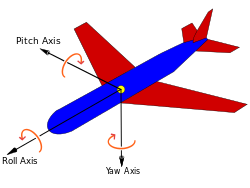
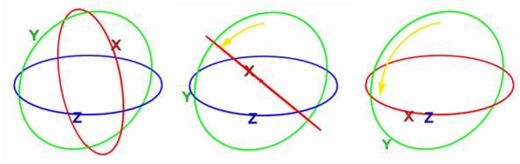

# Introduction

Ce projet consiste à implementer un simulateur de vol très simple, en utilisant `Garamon` pour les rotations et `OpenGL` pour l'affichage. L'utilisation de `Garamon` va se faire via les quaternions, qui permettent d'éviter plusieurs problèmes que l'on obtient avec les rotations classiques. Dans ce rapport, nous décrirons le simulatueur et des rotations, puis nous étudierons le principe théorique de chaque type de caméra implémenté. Enfin, nous verrons les détails d'implémentations de chacune d'entre elles.

# Le simulateur

Le simulateur de vol consistera en une caméra, qui representera l'avion, et qui va se déplacer en fonction du clavier de l'utilisateur. L'environnement, très simple, sera une texture de ciel tout autour de la camera. Pour se deplacer, on utilisera les commandes suivantes :

- `Z`/`S` pour orienter la caméra vers le haut / bas (`pitch`),
- `Q`/`D` pour orienter la caméra vers la gauche / droite (`yaw`), et
- `A`/`E` pour faire "rouler" la caméra sur la gauche / droite (`roll`).

Ces commandes permettent d'orienter l'avion dans toutes les directions, c'est ce qui va nous interresser au cours du projet. 

# Rotations

Le principe du projet va être d'appliquer une rotation sur le bon axe de la caméra quand la touche est pressée. Ces rotations sont définies par l'image suivante :



Ces 3 axes permettent d'obtenir 6 degrés de liberté, on peut tourner dans 6 directions differentes. 

# Caméras

Afin de pouvoir experimenter avec avec le simulateur, j'ai implémenté 3 caméras differentes, qui implémentent toutes trois une interface `Camera`. Cette interface contient, entre autres, les méthodes dont on a besoin pour controller l'avion (`moveFront`, `rotate` sur chaque axe) et surtout, pour obtenir la `viewMatrix`.
La `viewMatrix` est la matrice qui represente l'endroit duquel est vu le monde, et va permettre de "déplacer" le monde de façon à voir le monde depuis le point de vue de la caméra. Les trois types de caméras implémentées sont la `MatrixCamera`, la `EulerCamera` et la `QuaternionCamera`.

## Matrix Camera

La `MatrixCamera` est une caméra qui utilise des matrices de rotations, comme vues en cours, pour transformer la `viewMatrix`. Le principe repose sur le fait qu'une rotation sur un des trois angle influe uniquement sur une des lignes de la `viewMatrix`. On va de garder 3 angles, un pour chaque axe, qui vont être mis à jour à chaque appel à la fonction correspondante. Lors de l'appel à `getViewMatrix`, on va creer 3 matrices identités $I_{4}$, une pour chaque axe, et on va appliquer une rotation à chaque matrice par un vecteur différent, d'intensité égale à l'angle sauvegardé pour cet axe. La rotation `Roll` est appliquée avec le vecteur $(0, 0, 1)$, la rotation `Pitch` sur $(1, 0, 0)$ et la rotation `Yaw` sur $(0, 1, 0)$. Ensuite, on définit la matrice de rotation $R$ tel que :

\begin{equation}
R = M_{yaw} * M_{pitch} * M_{roll}
\end{equation}

Ensuite, la `viewMatrix` se définit à partir de $R$ et $T$ la matrice de translation selon l'opposé du vecteur de position de la caméra : 

\begin{equation}
V = R * T
\end{equation}

Pour le mouvement, il suffit de translater la position selon le vecteur frontal, que l'on peut retrouver dans la troisième colonne de la `viewMatrix`.

Cette camera a cependant quelques problèmes : si l'on effectue plusieurs rotations dans des sens différents, au bout d'un moment les rotations ne sont plus du tout cohérentes.

## Euler Camera

La `EulerCamera` repose sur un principe different, les angles d'Euler, qui sont souvent utilisés pour les caméras à la première personne : on garde 3 vecteurs orthogonaux $v_{up}$, $v_{right}$ et $v_{front}$, qui representent respectivement comme leur nom l'indique le haut de la caméra, sa droite et son avant. Ces trois vecteurs vont être modifiés lors des rotations, et l'on va ensuite calculer la `viewMatrix` à partir de ces trois vecteurs.

Les opérations effectuées sur les vecteurs pour un angle $\theta$ sont, par exemple pour un `Roll`:

\begin{equation}
\begin{aligned}
v_{right} &= v_{right} * \cos{\theta} + v_{up} * \sin{\theta}\\
v_{up} &= v_{right} * v_{front}
\end{aligned}
\end{equation}

Le principe est que le `Roll` n'est pas censé modifier le vecteur $v_{front}$, puisqu'on tourne autour. Le vecteur $v_{up}$ va subir une rotation autour de cet axe, et le vecteur $v_{right}$ sera le produit en croix des deux autres, puisqu'ils sont orthogonaux entre eux. Pour les deux autres rotations, le raisonnement est annalogue, on change juste les vecteurs.

Lors de l'appel à `getViewMatrix`, on va utiliser ces trois vecteurs ainsi que la position pour calculer la matrice, grâce à la méthode `lookAt` fournie par `OpenGL`.

Ces deux méthodes fonctionnent la plupart du temps, surtout celle avec les angles d'Euler, mais toutes deux sont affectées d'un problème particulier : le bloquage de cardan, ou *gimbal lock*. Ce problème survient lorsqu'on effectue une rotation de 90 degrés sur un axe, par exemple Y, les rotations sur X et Z auront le même effet sur l'objet, résultant en une perte d'un degré de liberté.



## Quaternion Camera

### Les quaternions

Afin d'eviter ce problème, on utilise les quaternions. Les quaternions sont l'equivalent 3D des nombres complexes. On a cette fois 3 valeurs imaginaires, $i$, $j$, et $k$, ainsi que les relations suivantes :

\begin{equation}
\begin{aligned}
i ^ 2 &= j ^ 2 = k ^ 2 = -1\\
ij &= k\ jk = i\ ki = j\\
ji &= -k\ kj = -i\ ik = -j
\end{aligned}
\end{equation}

On represente un quaternion quelconque $q$ avec un scalaire $w$ et un vecteur $u = (x, y, z)$ : 

\begin{equation}
q = w + xi + yj + zk
\end{equation}

Le principe des rotations est de pouvoir faire pivoter un point $p$ autour d'un vecteur $u$ selon un angle $\theta$ en utilisant la relation suivante : 

\begin{equation}
\begin{aligned}
q &= \cos{\frac{\theta}{2}} + u * \sin{\frac{\theta}{2}}\\
q^{-1} &= \cos{\frac{\theta}{2}} - u * \sin{\frac{\theta}{2}}\\
p' &= qpq^{-1}
\end{aligned}
\end{equation}

### En algèbre géometrique

Les quaternions sont inclus dans l'algèbre géometrique de Clifford. En effet, on peut retrouver les formules $(4)$ si l'on renomme :

\begin{equation}
\begin{aligned}
i &= -e_{23}\\
j &= -e_{31}\\
k &= -e_{12}
\end{aligned}
\end{equation}

On peut alors utiliser l'algèbre géometrique pour utiliser les quaternions et faire pivoter la caméra.

### La caméra

En utilisant les quaternions, la caméra va être capable de tourner sur les 3 axes sans craindre de bloquage de cardan. On va avoir, pour l'état de la caméra:

- Un "point" $p_{pos}$, c'est a dire un trivecteur dual tangent ($\bar{e_{0123}}$), qui représente la position de la caméra,
- Trois bivecteurs $v_{up}$, $v_{right}$ et $v_{front}$, qui reprensentent chacun une direction de la caméra, comme pour la caméra qui utilise les angles d'Euler.

Pour faire pivoter la caméra, on va générer un *Rotor*, quaternion qui representera la rotation autour de l'axe voulu, de l'angle voulu, et on va l'appliquer aux 2 autres bivecteurs. Par exemple, pour faire un `Pitch` d'angle $\theta$, on va générer un quaternion $R$ qui va representer cette rotation :

\begin{equation}
\begin{aligned}
R &= \cos{\frac{\theta}{2}} + v_{right} * \sin{\frac{\theta}{2}}\\
R^{-1} &= \cos{\frac{\theta}{2}} - v_{right} * \sin{\frac{\theta}{2}}
\end{aligned}
\end{equation}

On l'applique ensuite aux deux autres bivecteurs :

\begin{equation}
\begin{aligned}
v_{front} &= R * v_{front} * R^{-1}\\
v_{up} &= R * v_{up} * R^{-1}
\end{aligned}
\end{equation}

Pour le mouvement, on va utiliser, comme pour la `EulerCamera`, le bivecteur $v_{front}$ afin de connaître la direction, et pouvoir générer un *Translator* qui va permettre de déplacer le point $p_{pos}$. Par exemple, pour un mouvement selon un vecteur $(x, y, z)$ :

\begin{equation}
\begin{aligned}
u &= x * e_{1} + y * e_{2} + z * e_{3}\\
T &= 1 - \frac{u * e_{i}}{2}\\
T^{-1} &= 1 + \frac{u * e_{i}}{2}
\end{aligned}
\end{equation}

On l'applique ensuite au point $p_{pos}$ :

\begin{equation}
\begin{aligned}
p_{pos} &= T * p_{pos} * T^{-1}
\end{aligned}
\end{equation}

Enfin, pour la méthode `getViewMatrix`, on convertir les 3 bivecteurs et la position en vecteurs linéaires classiques, et utiliser la méthode `lookAt` d'`OpenGL`.

# Implementation

## Matrix Camera

La `MatrixCamera` utilise la librairie `glm` afin de gérer les opérations matricielles et vectorielles. L'essentiel est contenu dans la méthode `updateViewMatrix`. Les angles sont sauvegardés dans les champs `roll`, `pitch`, et `yaw` :

```cpp
void MatrixCamera::updateViewMatrix() {
	// 3 matrices identités, une pour chaque angle
	glm::mat4 matRoll = glm::mat4(1.0f);
	glm::mat4 matPitch = glm::mat4(1.0f);
	glm::mat4 matYaw = glm::mat4(1.0f);

	// On fait pivoter chaque matrice selon un vecteur différent
	matRoll = glm::rotate(matRoll, -roll, glm::vec3(0.0f, 0.0f, 1.0f));
	matPitch = glm::rotate(matPitch, -pitch, glm::vec3(1.0f, 0.0f, 0.0f));
	matYaw = glm::rotate(matYaw, -yaw, glm::vec3(0.0f, 1.0f, 0.0f));

	// Matrice de rotation
	glm::mat4 rotate = matYaw * matPitch * matRoll;

	// On translate selon la position
	glm::mat4 translate = glm::mat4(1.0f);
	translate = glm::translate(translate, -position);

	// On applique les deux matrices
	viewMatrix = rotate * translate;
}
```

## Euler Camera

Comme pour la `MatrixCamera`, les opérations matricielles et vectorielles sont gérées par `glm`. Cette fois, il n'y a pas de matrice sauvegardée, donc chaque vecteur $v_{up}$, $v_{right}$ et $v_{front}$ (ici nommés `upVector`, `rightVector` et `frontVector`) est mis à jour lors des rotations :

```cpp
void EulerCamera::rotateRoll(float degrees) {
	// Rotation autour du frontVector
	float angle = (degrees * glm::pi<float>()) / 180.f;
	rightVector = glm::normalize(rightVector * glm::cos(angle) 
				+ upVector * glm::sin(angle));
	upVector = glm::cross(rightVector, frontVector);
}

void EulerCamera::rotatePitch(float degrees) {
	// Rotation autour du rightVector
	float angle = (degrees * glm::pi<float>()) / 180.f;
	frontVector = glm::normalize(frontVector * glm::cos(angle) 
				+ upVector * glm::sin(angle));
	upVector = glm::cross(rightVector, frontVector);
}

void EulerCamera::rotateYaw(float degrees) {
	// Rotation autour du upVector
	float angle = (degrees * glm::pi<float>()) / 180.f;
	rightVector = glm::normalize(rightVector * glm::cos(angle) 
				+ frontVector * glm::sin(angle));
	frontVector = glm::cross(upVector, rightVector);
}
```

La méthode `lookAt` de `glm` est appelée ainsi :

```cpp
glm::mat4 EulerCamera::getViewMatrix() {
	return glm::lookAt(position, position + frontVector, upVector);
}
```

## Quaternion Camera

Afin d'implémenter les quaternions, j'ai utilisé l'algèbre géometrique conforme en 3D (*conformal geometric algebra*) : `c3ga`. L'implémentation est un peu plus complexe. Dans un premier lieu, on définit les `rotor` et `translator` comme ceci :

```cpp
c3ga::Mvec<float> translator(float x, float y, float z) {
	// translation selon un vecteur (x, y, z)
	c3ga::Mvec<float> t = x * c3ga::e1<float>() 
						+ y * c3ga::e2<float>() 
						+ z * c3ga::e3<float>();
	return 1 - 0.5 * t * c3ga::ei<float>();
}

c3ga::Mvec<float> rotor(const c3ga::Mvec<float> & B, float d) {
	// rotation de d degrés autour du bivecteur B
	float a = (d * glm::pi<float>()) / 180.f;
	return std::cos(0.5 * a) + std::sin(0.5 * a) * B;
}
```

Ensuite, on peut les utiliser pour faire pivoter les axes de cette façon (`R` est un *Rotor* obtenu grâce à la méthode précedente) :

```cpp
void QuaternionCamera::rotateAxes(const c3ga::Mvec<float> & R) {
	// Rotation des 3 axes
	frontVector = R * frontVector / R;
	rightVector = R * rightVector / R;
	upVector = R * upVector / R;
}
```

Pour le mouvement, on trouve le vecteur $(x, y, z)$ à utiliser pour le *translator* à partir des coefficients $e_{13}$, $e_{12}$, et $e_{23}$ de $v_{front}$ :

```cpp
void QuaternionCamera::moveFront(float t, int limit) {
	// Creation du translator
	c3ga::Mvec<float> T = translator(
		-t * frontVector[c3ga::E13], 
		-t * frontVector[c3ga::E12], 
		-t * frontVector[c3ga::E23]);
	// Application de la translation
	position = T * position / T;
}
```

Enfin, la conversion en vecteurs `glm` à partir des bivecteurs et du point se fait comme tel :

```cpp
glm::mat4 QuaternionCamera::getViewMatrix() {
	glm::vec3 glmPosition(position[c3ga::E1], 
						  position[c3ga::E2], 
						  position[c3ga::E3]);
	glm::vec3 glmFrontVector(-frontVector[c3ga::E13], 
							 -frontVector[c3ga::E12], 
							 -frontVector[c3ga::E23]);
	glm::vec3 glmUpVector(upVector[c3ga::E13], 
						  upVector[c3ga::E12], 
						  upVector[c3ga::E23]);
	return glm::lookAt(glmPosition, glmPosition + glmFrontVector, glmUpVector);
}
```

## Reste du programme

Le reste du programme (le `main`, l'implémentation d'`OpenGL` pour la `skybox`, etc) est tiré de notre projet d'`OpenGL` avec Mr. Venceslas Biri, le **[Mastercraft](https://github.com/Odomar/MasterCraft)**, qui a été développé par Denis Biguenet et moi-même. L'implémentation utilise `Glew` et `OpenGL`, ainsi que `SDL 1.2`.

# Conclusion

Ce projet de simulateur de vol a été intérressant car il se penche sur la façon d'implémenter une caméra de type à la première personne, question qui n'est pas si triviale. En effet j'ai appris à implémenter 3 types de caméras différentes, ce qui m'a permis en plus de mieux comprendre la `viewMatrix` d'`OpenGL`. Enfin, j'ai appris à utiliser les quaternions, afin de réaliser des rotations sans risquer de *gimbal lock*.

Les quaternions sont des objets puissants, qui peuvent être utilisés, en plus de ce type de caméra, pour effectuer des interpolations entre différents angles en 3D, cela permet de faire des transitions naturelles pour une caméra à la troisième personne. Le jeu *Tomb Raider*, un des premiers à utiliser les quaternions dans sa caméra, l'a utilisé pour faire des interpolations entre les placements de la caméra lors du mouvement du personnage.

Le lien du projet sur **[Github](https://github.com/Odomar/FlightSim)**